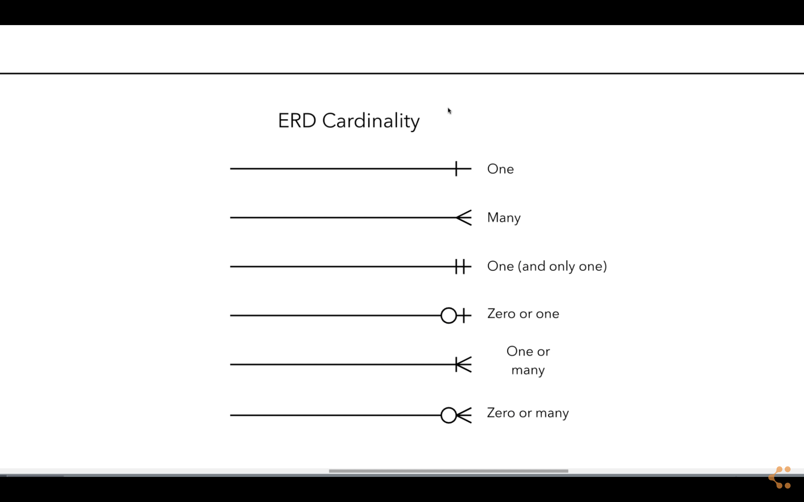
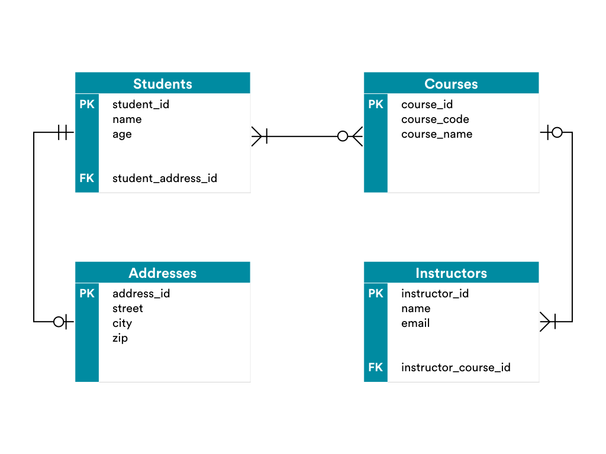

# Relational Database Modeling

## Introduction

[Entity Relationship Diagram](https://www.visual-paradigm.com/guide/data-modeling/what-is-entity-relationship-diagram/), also known as ERD, ER Diagram, or ER model, is a type of structural diagram for use in database design. An ERD contains different symbols and connectors that visualize two important information: The major entities within the system scope, and the inter-relationships among these entities.

And that's why it's called "Entity" "Relationship" diagram (ERD)!

We'll use crow's foot notation to create entity relationship diagrams (ERDs) that represent relational database models.

### Let's Work on an Example Together 

Together as a group we will create an ERD of the database we built yesterday for General Assembly. 

Let's first list out all the entities we created:

- Student
- Address
- Instructor
- Course

We can use ERD Cardinality for reference.

Here's what it should look like in the end.

------

## SETUP:

You will navigate to [Visual Paradigm](https://online.visual-paradigm.com/) to create a free account, and use the visual design tools to create a Schema using ERD diagramming. When you are done, take a **SCREEN SHOT** of the final schema design and place the screen shot in this lab folder: `03 Database-Modeling-Lab (D)`.

To create your **free** account =>
1. Navigate to [Visual Paradigm](https://online.visual-paradigm.com/)
2. Sign Up (you can use your google acct)
3. Once logged in, the main page will provide you with diagram templates that you can use. The `Class Diagram` template is great.
   

4. A new page will open on the class diagrams page.
5. **Select** a starting point from this page and choose to **edit that template**.
6. Work to figure out how to show the relationships amongst the entities provided in the chart below. 
7. **BE SURE TO CHANGE THE FIELDS TO REFLECT INFORMATION YOU WOULD EXPECT TO SEE FOR THESE ENTITIES**
8. Your final submission should be a screen shot that looks similar to this:

## INSTRUCTIONS:

Convert the following restful routes into a full Schema / Database design via ERD Diagramming to express the relationships in your database.

Here’s an HTML table representing RESTful routes for four different entities:

- Users (One-to-One with Profile)
- Profiles (One-to-One with Users)
- Posts (One-to-Many with Users)
- Tags (Many-to-Many with Posts)

<table border="1" width="100%">
    <thead>
        <tr>
            <th width="15%">Entity</th>
            <th width="25%">HTTP Method</th>
            <th width="50%">Endpoint</th>
            <th width="10%">Payload Required?</th>
        </tr>
    </thead>
    <tbody>
        <tr><td>Users</td><td>GET</td><td>/users</td><td>No</td></tr>
        <tr><td>Users</td><td>GET</td><td>/users/{id}</td><td>No</td></tr>
        <tr><td>Users</td><td>POST</td><td>/users</td><td>Yes</td></tr>
        <tr><td>Users</td><td>PUT</td><td>/users/{id}</td><td>Yes</td></tr>
        <tr><td>Users</td><td>DELETE</td><td>/users/{id}</td><td>No</td></tr>
    </tbody>
</table>

<table border="1" width="100%">
    <thead>
        <tr>
            <th width="15%">Entity</th>
            <th width="25%">HTTP Method</th>
            <th width="50%">Endpoint</th>
            <th width="10%">Payload Required?</th>
        </tr>
    </thead>
    <tbody>
        <!-- Profiles (One-to-One with Users) -->
        <tr><td>Profiles</td><td>GET</td><td>/users/{id}/profile</td><td>No</td></tr>
        <tr><td>Profiles</td><td>POST</td><td>/users/{id}/profile</td><td>Yes</td></tr>
        <tr><td>Profiles</td><td>PUT</td><td>/users/{id}/profile</td><td>Yes</td></tr>
        <tr><td>Profiles</td><td>DELETE</td><td>/users/{id}/profile</td><td>No</td></tr>
    </tbody>
</table>

<table border="1" width="100%">
    <thead>
        <tr>
            <th width="15%">Entity</th>
            <th width="25%">HTTP Method</th>
            <th width="50%">Endpoint</th>
            <th width="10%">Payload Required?</th>
        </tr>
    </thead>
    <tbody>
        <tr><td>Posts</td><td>GET</td><td>/posts</td><td>No</td></tr>
        <tr><td>Posts</td><td>GET</td><td>/posts/{id}</td><td>No</td></tr>
        <tr><td>Posts</td><td>POST</td><td>/users/{id}/posts</td><td>Yes</td></tr>
        <tr><td>Posts</td><td>PUT</td><td>/posts/{id}</td><td>Yes</td></tr>
        <tr><td>Posts</td><td>DELETE</td><td>/posts/{id}</td><td>No</td></tr>
    </tbody>
</table>

<table border="1" width="100%">
    <thead>
        <tr>
            <th width="15%">Entity</th>
            <th width="25%">HTTP Method</th>
            <th width="50%">Endpoint</th>
            <th width="10%">Payload Required?</th>
        </tr>
    </thead>
    <tbody>
        <tr><td>Tags</td><td>GET</td><td>/tags</td><td>No</td></tr>
        <tr><td>Tags</td><td>GET</td><td>/tags/{id}</td><td>No</td></tr>
        <tr><td>Tags</td><td>POST</td><td>/tags</td><td>Yes</td></tr>
        <tr><td>Tags</td><td>PUT</td><td>/tags/{id}</td><td>Yes</td></tr>
        <tr><td>Tags</td><td>DELETE</td><td>/tags/{id}</td><td>No</td></tr>
    </tbody>
</table>

<table border="1" width="100%">
    <thead>
        <tr>
            <th width="15%">Entity</th>
            <th width="25%">HTTP Method</th>
            <th width="50%">Endpoint</th>
            <th width="10%">Payload Required?</th>
        </tr>
    </thead>
    <tbody>
        <tr><td>Post-Tags</td><td>POST</td><td>/posts/{post_id}/tags/{tag_id}</td><td>No</td></tr>
        <tr><td>Post-Tags</td><td>DELETE</td><td>/posts/{post_id}/tags/{tag_id}</td><td>No</td></tr>
    </tbody>
</table>

### Additional Resources

- [Crow's Foot Notation Cheat Sheet](http://www.vivekmchawla.com/content/images/2013/Dec/ERD_Relationship_Symbols_Quick_Reference-1.png)
- An Extra-Relevant [Resource for Students](https://developer.mozilla.org/en-US/docs/Web/Events)

